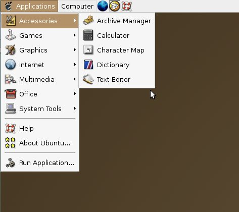

#Chapter 1: Ubuntu, your options, and is it right for you?

So, first off - what is Ubuntu?

The Ubuntu website says this:

> “Fast, secure and stylishly simple, the Ubuntu operating system is used by 
> 20 million people worldwide every day.”

Well, that’s true, but it’s also not true. 

Ubuntu is more than just a Operating system, it’s a way of thought.
Ok, cue all the  1990’s Linux Guys who are all like “OMG WHAT IS THIS GUY SMOKING?!” 
(no reference to the Ubuntu tabloid OMG! Ubuntu! - we’ll get to them in the community chapter).

Ubuntu is..... Open Source.

> Our global community is made up of thousands of people who want to help build
> the best open-source operating system in the world. 
> They share their time and skills to make sure that Ubuntu keeps getting better and better.
> From IBM to Google, Firefox to Wikipedia – some of today's best software is based 
> on an open-source model. Shared efforts. Shared principles. No cost.

That’s what the Ubuntu website says - but is that really what Ubuntu is? 
Well, yes. And well, no.

Ubuntu is more than the sum of it’s parts - Ubuntu has some very vibrant
(and outspoken) upstreams - that is, the GNOME developers, 
the Firefox developers, and the Kernel Developers.

Ubuntu has a community. And that is what makes Ubuntu “awesome”. 
Yeah, it has some problem spots - it wouldn’t be a community if it didn’t.
But they (traditionally) get resolved fairly quickly, and to the satisfaction 
of the parties involved.

##Ubuntu: A whirlwind tour through the history of the worlds most popular Linux distro.

Travel back with me to the year 2004. A guy by the name of “Mark Shuttleworth” 
had been doing something with a bunch of Debian Linux (more on that later) developers - 
they were known as “The super secret debian startup”.
There was an IRC (internet relay chat) channel on Freenode - was known as #weirdos - 
the team hung out there.

The team comprised of folks such as Jeff Waugh, Robert Collins and Thom May - 
Scott James Remnant joined the team shortly thereafter. config

On the 20th of October, 2004, the world changed, just a little bit.

Ubuntu 4.10 was released to the world.

A little bit ugly, huh? Just a tad.

Over the years, Ubuntu got more and more powerful,
and more and more popular. I chose those words for a reason - 
the “powerful” part is a big thing that people often forget.

##Why is Ubuntu popular? 

Well, there are a number of reasons for this -
it’s hard to explain, but it’s easy to know. 

Ubuntu has a lot going for it - it’s based on Debian, 
which was one of the more popular rock-solid Linux distros, 
and still is popular to this day.

It works out of the box for most people. 
Have a rare, obscure graphics card? While you might have a little trouble with 
it in some edge cases, it will probably  without any issues.

It’s powerful.

It uses good ‘ole Debian (I keep going back to Debian), 
which has a large amount of packages, a awesome package system 
(dpkg, which we’ll cover how to use later on), 
and you’ll probably get packages for a Debian based Linux faster than a Red Hat Linux.
(generally speaking)
But Ubuntu doesn’t realize that it can make (or break) a FOSS 
(FOSS = Free Open Source Software) project - when Ubuntu decides to ship something 
on the CD by default, it’s a Big Thing ™ - and rightly so.

Alright, enough of the history, and object lessons. 
Lets get a move on to the real stuff, ok?

##Why would Ubuntu be right for you, and why might it not be right for you?

This is the question of the ages -  and the answer doesn’t always work for everyone,
and it doesn’t always work (or evey make sense).

However, what follows is my opinion on this topic, and they might be yours.

Ubuntu is *not* for you if...

- You use Adobe products for a living - mainly, Adobe Photoshop, Illustrator, Final Cut Pro, etc.
- You are a devout Windows user, and you pay homage to the Blue Screen of death.
- You work at Microsoft.
- You love gaming. Seriously, unless you only play Minecraft or Farmville, Ubuntu is not for you.

On the other hand, Ubuntu *is* for you if...

- You are a programmer in Ruby, Python, C++, C, or anything that will probably run on a Linux server.
- You only play Minecraft or Farmville.
- You're sick of paying homage to the Blue Screen of Death.
- You don't work at Microsoft.
- You are a server administrator.
- You want to give a new life to a older computer (or two, or three or... you get the point)

Decided if you're interested in running Ubuntu? Ok, if you're interested, next page please!