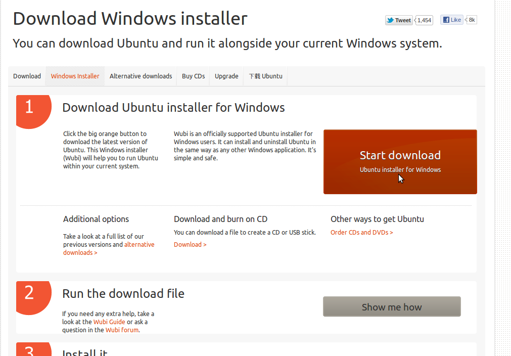
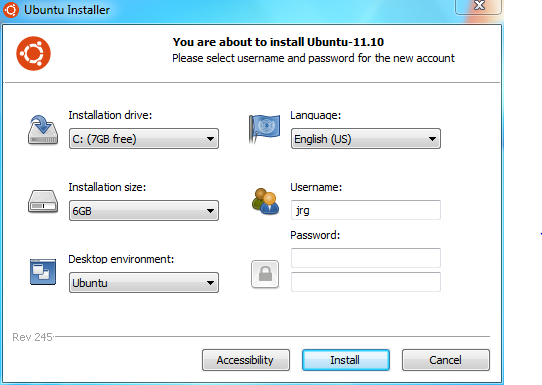
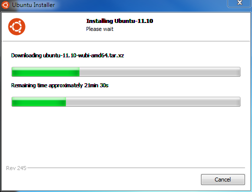
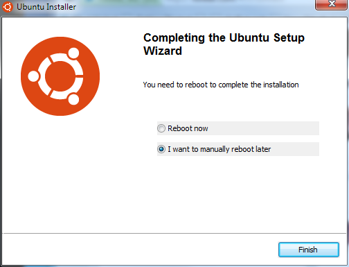

#Chapter 2: Installing Ubuntu.

There are several ways of doing this, but for this one we're going to use the
Wubi method.

First, head over to [ubuntu.com/download/desktop/windows-installer][wubi],
and download the Windows installer. We’re assuming that you want to keep
Windows, because otherwise things get complicated.

Once you've downloaded it, open it up and you should see this:

Fill in your username and password, and then hit next.

Now you should see this:

Just wait for it to download — go talk a walk around the block
or something, because this will take awhile.

When it is all done, you should see this:

Congrats! Reboot, and you should be good to go! Welcome to Ubuntu.

[wubi]: http://www.ubuntu.com/download/desktop/windows-installer
