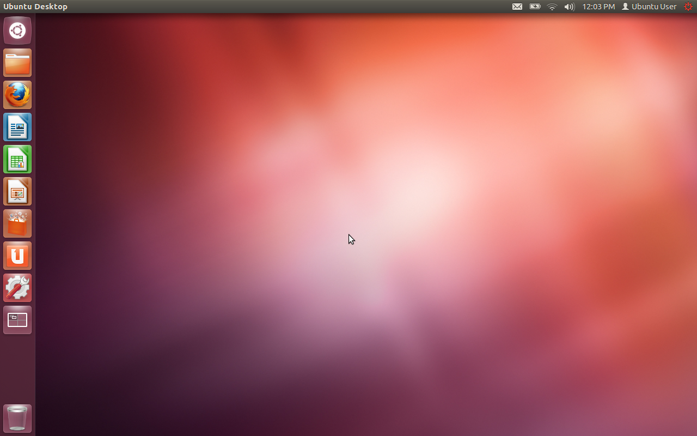
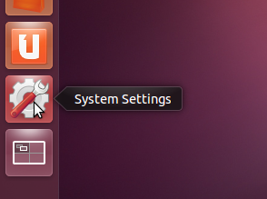
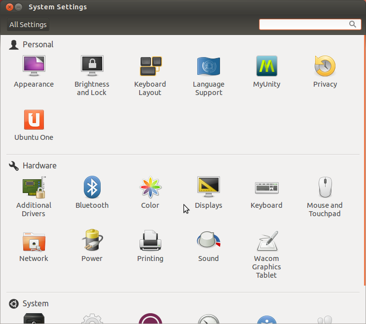
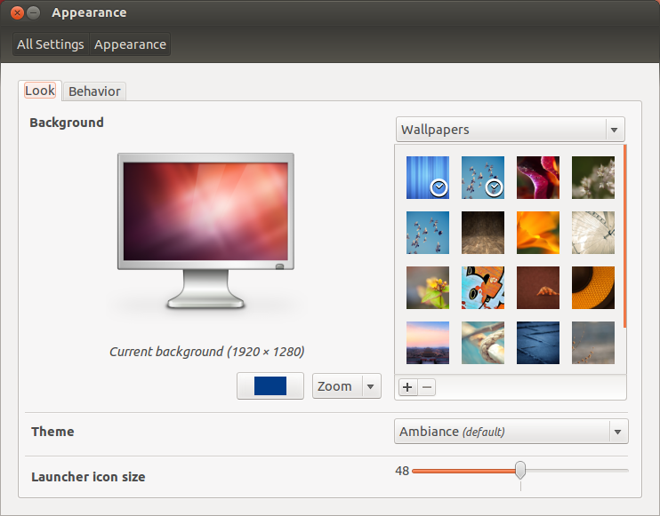
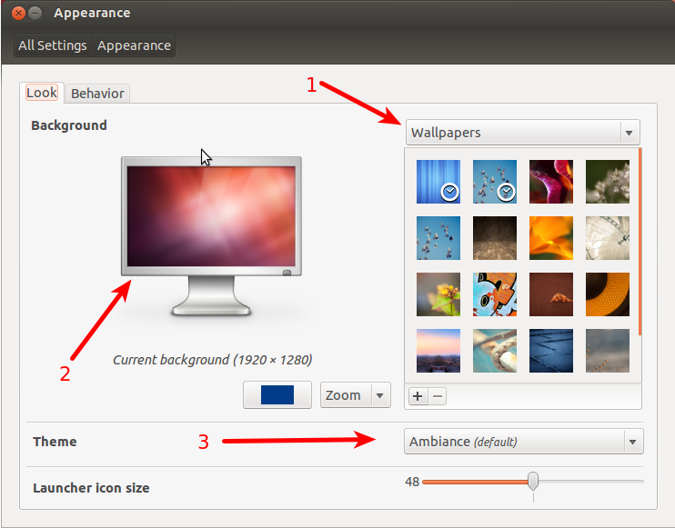
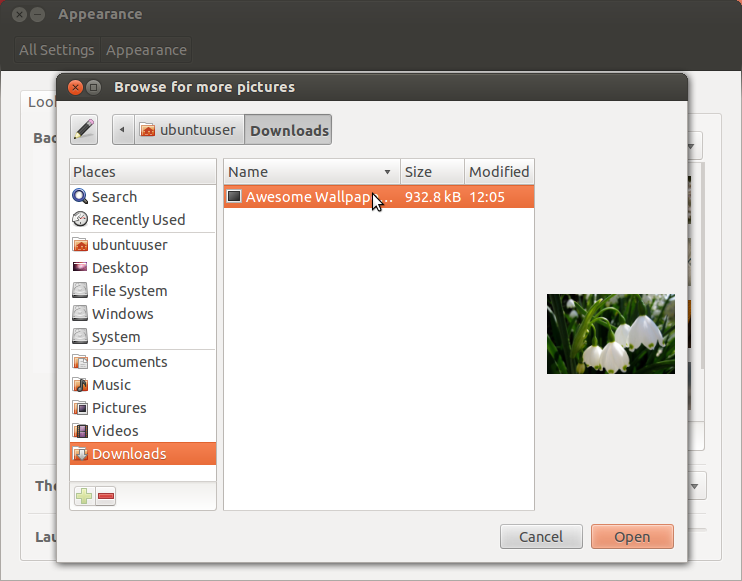
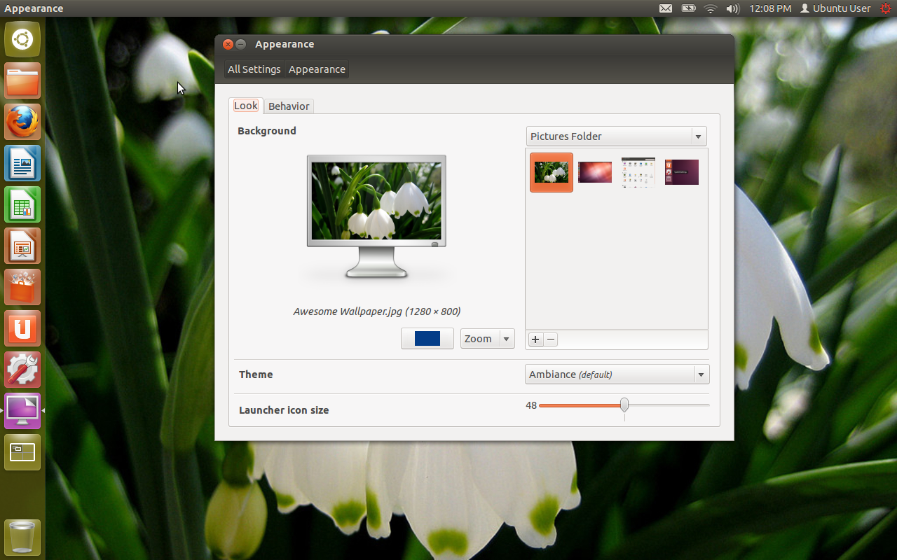

##Chapter 4: Tweaking Ubuntu.

So, our desktop looks something like this:

A little plain, huh?

Lets spice things up with a cool wallpaper.

First, download a wallpaper you like - I'm just going to use one that 
I've had for a few months and lost track of where I found it.

Open up System Settings. 

Now you should see this:

Click the appearance icon in the top left corner.

Now, lets take a look at what we have going on here.

1. The default wallpaper list.
2. The current background - this is what your computer looks like
3. The options to select a theme.

Click the little "+" button to the bottom left of the wallpaper list.

Navigate to where your wallpaper is (mine is in the Download folder)
and then click the "Open" button. 

Now take a look!

Our shiny new wallpaper is set!

In a future chapter, we'll go through some more advanced options.

