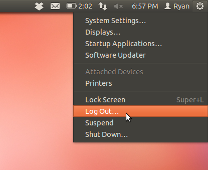

# Chapter 6: Getting Under The Hood of Ubuntu.

You have two options for tweaking your system past what is available in the default settings - Ubuntu Tweak, and Gnome Tweak Tool. Both are good, but I’ll only be covering the Ubuntu Tweak side of things, just for simplicity, since Gnome Tweak Tool  also brings in some extra software that is beyond the scope of this book, while Ubuntu Tweak is simple, and does it well.

Open up a terminal (press the Super/Windows key, then type in “Terminal”) and run the following:

	sudo add-apt-repository ppa:tualatrix/next

You’ll see something like this:

Now run these commands:

	sudo apt-get update

	sudo apt-get install ubuntu-tweak -y

Once you’ve done that, you’ll be able to launch Ubuntu Tweak by opening the dash (press the Super/Windows key) and then typing in “Ubuntu Tweak”.

Then, you’ll be presented with this:

You’ll notice that it tells you some basic information about your hardware, and it tells you some information about your actual computer - primarily your hostname (the computers name), your Ubuntu Version (in this case, Ubuntu 11.10 Oneiric) and your desktop enviroment - in the screenshot, I was running Unity 2D.

Click the “Tweaks” tab. You’ll see something like this:

Lets go tweak the menubar a bit.

By default, it looks something like this:

 *This image does not yet exist*

We want to remove the “Ryan” (of course substituting your name instead of mine) from the menubar - it gets somewhat annoying, particularly on a netbooks display.

Click the “Session Indicator” option in the “Tweaks” section.

You’ll see this:

Uncheck the “Show user’s real name on the panel” option that has the big red arrow next to it.

Log out, and then log back in.

To log out, click the little power cog in the top right hand corner, and select the log out option:

Now, your name will be gone from the menubar!

Now, let’s tweak Unity itself.

If you’re logged in using Ubuntu, or Unity 3D (they are the same thing, just the two different names they go under), you’re going to have some options for the Unity launcher.

You can change the icon size, the launcher opacity, the launcher hide mode and the launcher “reveal edge timeout”.

Feel free to play around with this - if you press the little button on the far right, it will reset that option.